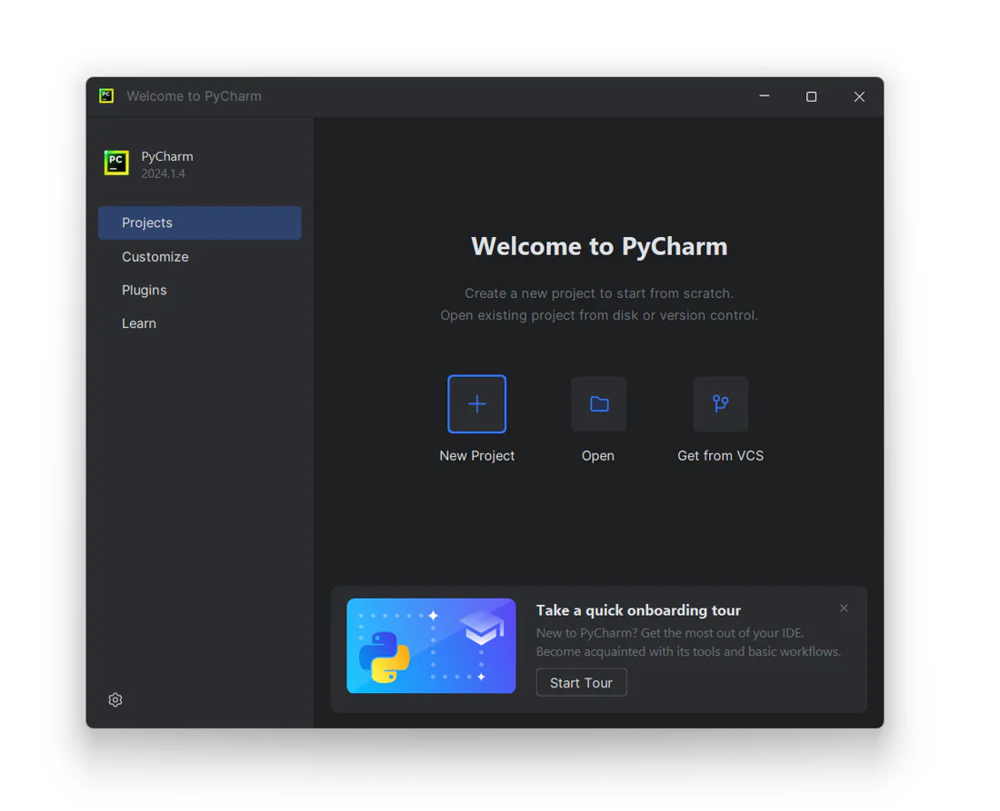
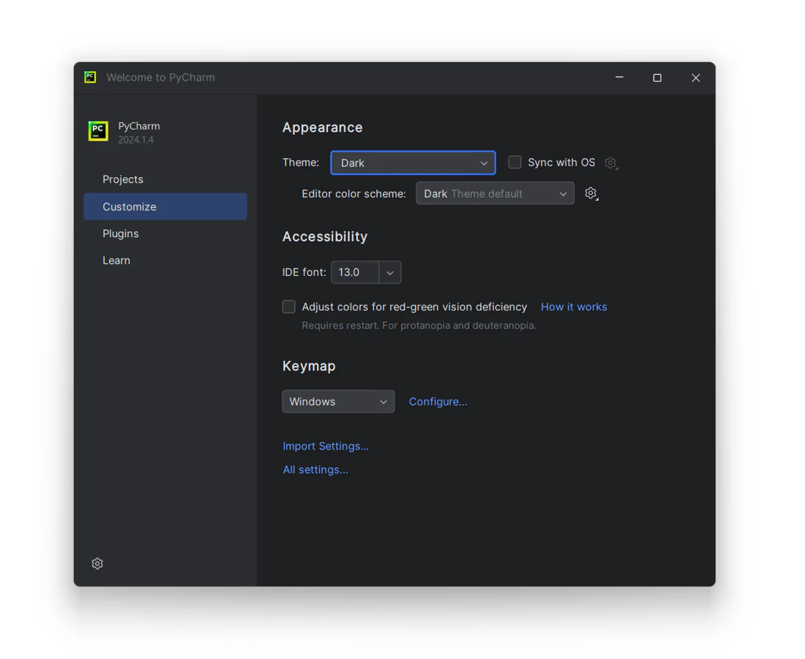
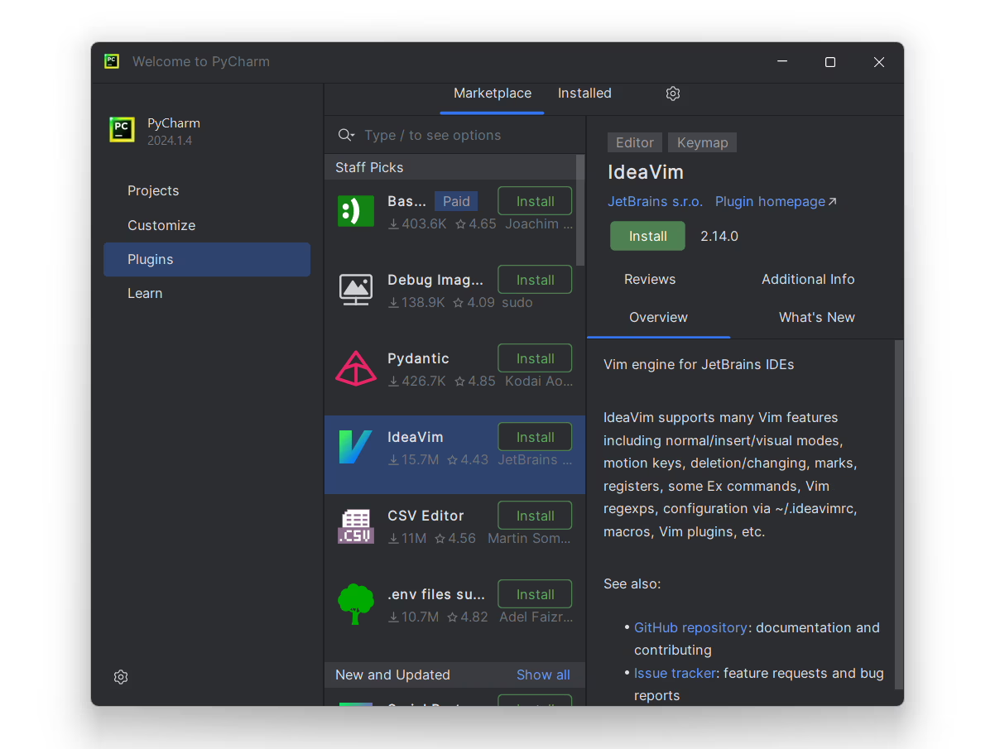
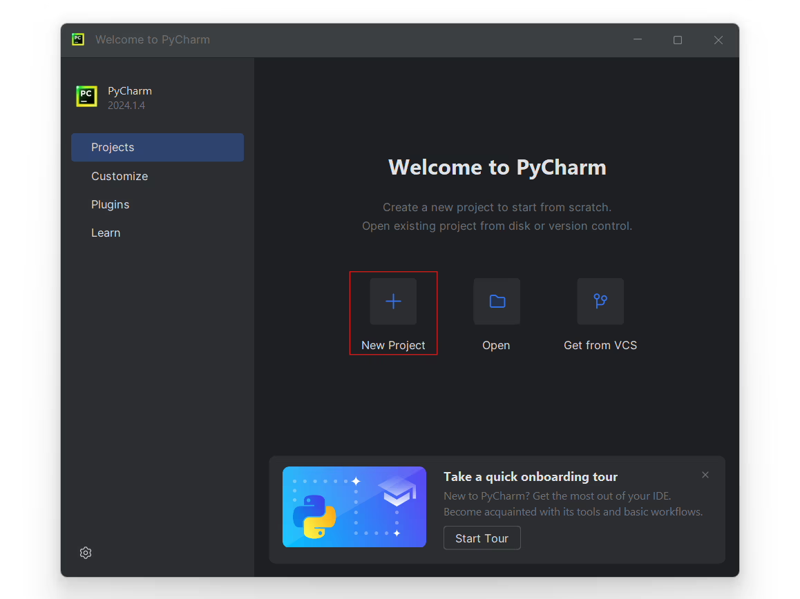
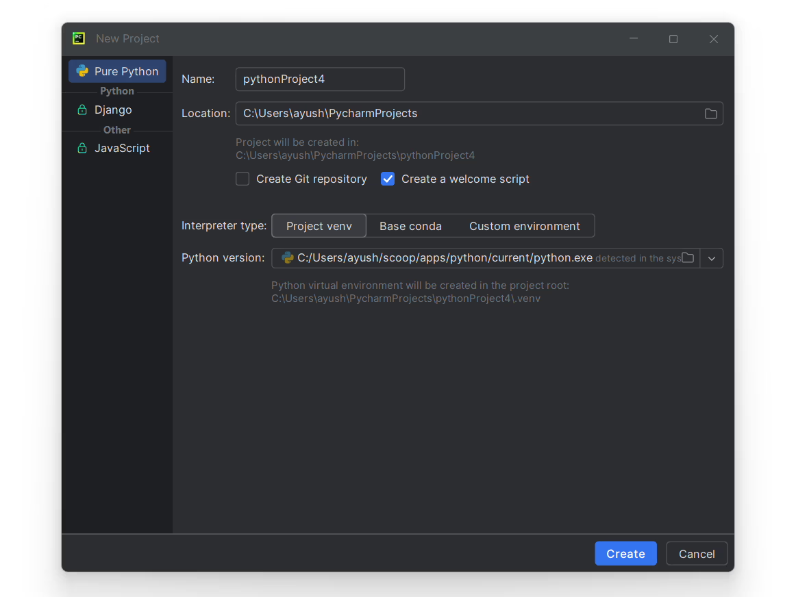
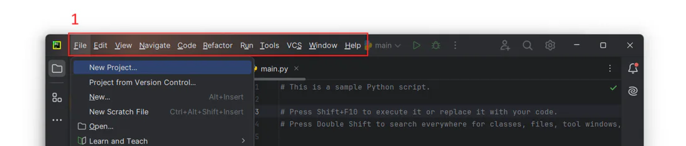
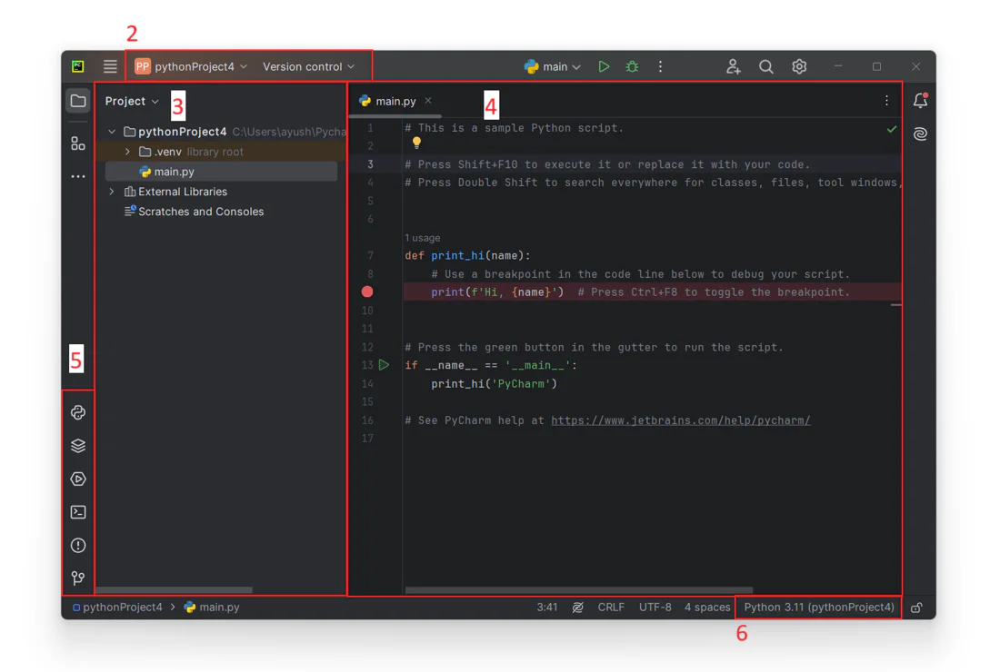
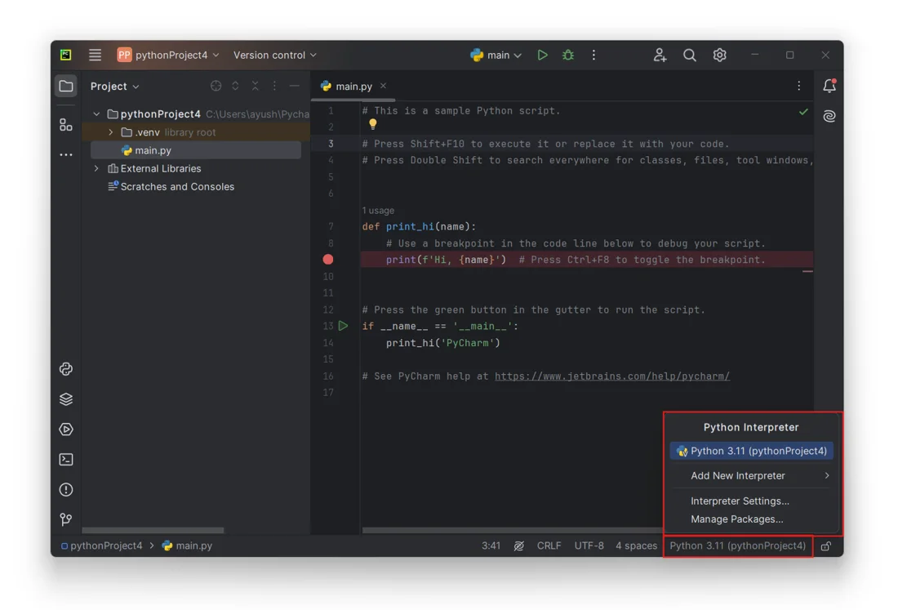
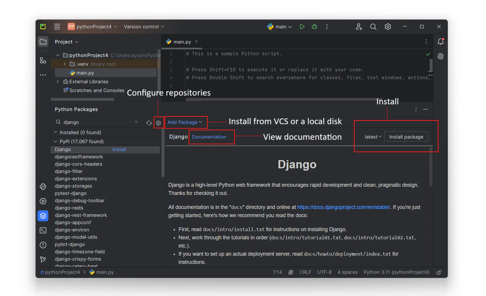

# Conceptes bàsics de PyCharm

Quan comenceu a programar, un entorn de desenvolupament integrat (IDE) us pot ajudar amb els principals fluxos de treball dels desenvolupadors i us permetrà seguir centrant-vos en les especificitats del llenguatge. Us animem a utilitzar PyCharm per als vostres projectes Python. PyCharm és un IDE de Python dedicat que ofereix una varietat de funcions útils com ara la finalització de codi, les inspeccions de codi, la navegació per projectes i les refactoritzacions.

## Visió general

PyCharm està disponible en dues edicions: Community i Professional.

L'edició Community és gratuïta i de codi obert. Ve amb tot el que necessiteu per al desenvolupament intel·ligent i intel·ligent de Python, inclosa l'assistència de codi, refactoritzacions, depuració visual i integració de control de versions. PyCharm Professional és una versió de pagament de PyCharm que està dirigida al desenvolupament professional de Python, web i ciència de dades. Amb PyCharm Professional, podeu crear aplicacions de marc web, desenvolupar de forma remota, analitzar grans dades i treballar amb quaderns Jupyter. Vegeu més detalls sobre cada edició a la pàgina del producte [PyCharm](https://www.jetbrains.com/pycharm/).

## Instal·leu i executeu PyCharm

Abans de començar, comproveu els requisits de memòria i sistemes operatius als Requisits del sistema PyCharm.

### Instal·leu Python

PyCharm és un IDE específic de Python, de manera que necessiteu una mica de Python per començar el vostre treball. Baixeu-lo des de python.org i, a continuació, instal·leu-lo segons els requisits del vostre sistema operatiu.

### Baixeu i instal·leu PyCharm

Baixeu PyCharm Community des de https://www.jetbrains.com/pycharm/download.

Executeu l'instal·lador i seguiu els passos de l'assistent. Vegeu més detalls a la Guia d'instal·lació de PyCharm.

Tingueu en compte que podeu optar per una instal·lació autònoma o una aplicació Toolbox que sigui útil quan necessiteu instal·lar diversos IDE de JetBrains o gestionar diverses versions de PyCharm.

### Inicieu PyCharm

Per iniciar PyCharm, feu l'acció següent en funció del vostre sistema operatiu:

Windows: executeu PyCharm mitjançant el menú Inici de Windows o la drecera de l'escriptori

macOS: executeu l'aplicació PyCharm des del directori d'aplicacions

Linux: executeu l'script de l'intèrpret d'ordres pycharm.sh al directori d'instal·lació a bin

### Pantalla de benvinguda

Un cop inicieu PyCharm, veureu la **pantalla de benvinguda**:

A la **pantalla de benvinguda**, podeu trobar totes les opcions i configuracions per començar el vostre treball a PyCharm. La manera més ràpida és crear un projecte nou des de zero o obrir un projecte existent des d'una unitat local o un dipòsit.

La pàgina d'inici també conté un enllaç al recorregut d'incorporació de PyCharm que us ajudarà a familiaritzar-vos amb el flux de treball del desenvolupador principal en només 7 minuts. Feu el recorregut per fer que el vostre inici sigui encara més fluid.

### Inici ràpid

Podeu començar el vostre treball a l'IDE sense configurar res abans perquè PyCharm ofereix gairebé totes les funcions de manera immediata. No obstant això, sigui el que facis a PyCharm, ho fas en el context d'un projecte. Un projecte és una unitat organitzativa que serveix de base per a l'assistència a la codificació, la refactorització massiva i la coherència de l'estil de codificació. Per tant, heu de començar amb una configuració del projecte. Tens les opcions següents:

* [<u>***Creeu un projecte nou***</u>](https://www.jetbrains.com/help/pycharm/creating-and-running-your-first-python-project.html): creeu un projecte nou al vostre sistema de fitxers i configureu un entorn Python mitjançant la vostra instal·lació de Python.

* [<u>***Obre un projecte existent***</u>](https://www.jetbrains.com/help/pycharm/open-projects.html#open-local-project): obriu un projecte PyCharm existent. També podeu obrir qualsevol carpeta del vostre sistema de fitxers i PyCharm detectarà qualsevol entorn Python configurat prèviament.

* [<u>**Obteniu un projecte des d'un sistema de control de versions**</u>](https://www.jetbrains.com/help/pycharm/open-projects.html#git): cloneu un projecte des d'un dipòsit **`Git`**, **`Mercurial`** o **`Subversion`**.

### Inici personalitzat

A la pantalla de benvinguda, podeu ajustar la configuració predeterminada de l'IDE. Feu clic a Personalitza i seleccioneu un altre tema de color o seleccioneu la casella de selecció Sincronitza amb el sistema operatiu per utilitzar el tema predeterminat del vostre sistema. Aquí també podeu configurar la configuració d'accessibilitat o seleccionar un altre mapa de tecles.

També podeu fer clic a **All settings** (***Tots els paràmetres***) per obrir el diàleg de configuració. La configuració que modifiqueu en aquest moment es convertirà en la nova configuració per defecte dels vostres projectes i de l'IDE.

Tot i que PyCharm Community inclou totes les funcions principals, podeu ampliar-les instal·lant connectors. Feu clic a Connectors al panell esquerre de la pantalla de benvinguda i, a continuació, descarregueu i instal·leu els connectors necessaris des del [**PyCharm plugins repository**](https://plugins.jetbrains.com/pycharm) (***Repository de connectors de PyCharm***).

Amb això, ja esteu preparat per crear la vostra primera aplicació Python.

## Creeu un projecte Python a PyCharm

Per crear un projecte Python nou, seguiu els passos següents:

1. A la pantalla de benvinguda, seleccioneu **New Project** (***Nou projecte***):

    

1. Al diàleg **New Project** (***Nou projecte***), PyCharm omple tots els camps necessaris. L'IDE crearà un ***entorn virtual Python*** i el gestor de paquets integrat de Python, que us permetrà instal·lar biblioteques externes. La llista d'intèrprets de base indica el camí cap al Python real, que descarregueu i instal·leu al vostre ordinador.

    

1. Per tant, en aquest punt, podeu seleccionar un tipus d'entorn: Entorn virtual (predeterminat), Conda, Pipenv o Poetry, i crear-lo mitjançant un dels intèrprets Python instal·lats al vostre sistema. Consulteu [Creating Python Projects](https://www.jetbrains.com/help/pycharm/creating-empty-project.html)(***Creació de projectes Python***) per obtenir més detalls sobre altres opcions de projecte.

1. Tingueu en compte la casella de selecció **Create a welcome script** (***Crea un script de benvinguda***). Està seleccionat per defecte. Amb aquesta opció activada, PyCharm crea un fitxer Python amb algun codi bàsic que pot ser un bon punt de partida per a la vostra aplicació.

1. Feu clic a <kbd>Create</kbd> (***Crea***) per completar la tasca.

Quan es crea el projecte, s'obre el fitxer main.py a l'editor. Aquest fitxer mostra l'script bàsic i ofereix consells útils perquè pugueu començar a editar el codi a PyCharm. De moment, recordeu una de les [dreceres més útils](https://www.jetbrains.com/help/pycharm/searching-everywhere.html) <kbd>Shift</kbd> <code>+</code> <kbd>Shift</kbd>. Obre un diàleg on podeu trobar qualsevol comanda, configuració, construcció de codi o fitxer de projecte. Consulteu [**Working with Source Code in PyCharm**](https://www.jetbrains.com/help/pycharm/working-with-source-code.html)  (***Treballar amb el codi font a PyCharm***) per obtenir més detalls sobre l'ajuda de codificació disponible.

Podeu afegir més fitxers de diversos tipus al vostre projecte, així com directoris i paquets Python. Tots estan llistats a la finestra de l'eina Projecte. Consulteu el següent tema d'ajuda web de PyCharm per obtenir més detalls sobre com afegir fitxers i directoris a un projecte: [Populating PyCharm Projects](https://www.jetbrains.com/help/pycharm/populating-projects.html)(***Omplint projectes PyCharm***).

Ja heu après sobre l'editor PyCharm i la finestra de l'eina Projecte. Vegem tota la interfície d'usuari de PyCharm:

Els elements principals de la IU IDE són:

1. Menú principal. La seva posició és específica del sistema operatiu;
1. La barra de navegació i la barra d'eines principal;
1. Finestra d'eina de projecte;
1. Editor;
1. Finestres d'eines que inclouen la consola de Python i les finestres de paquets de Python;
1. Selector d'intèrpret Python. Mostra l'entorn que està configurat actualment per al projecte.

Després de fer-ho, heu creat un projecte PyCharm i heu configurat un intèrpret de Python per a ell. Podeu crear més intèrprets de Python si necessiteu diversos entorns per executar els vostres scripts (per exemple, quan els voleu executar en diferents versions de Python).

## Crea intèrprets Python

La manera més senzilla d'obrir la configuració de l'intèrpret de Python és fer clic al selector de **Python Interpreter** (***l'intèrpret de Python***) situat a la part més baixa de la finestra de PyCharm, a la seva barra d'estat.

1. Feu clic al selector d'intèrpret. Hauríeu de poder veure tots els intèrprets que s'han configurat per ser utilitzats per tots els projectes.

    

1. Seleccioneu **Add New Interpreter** > **Add Local Interpreter** (***Afegeix un intèrpret nou > Afegeix un intèrpret local***) al menú.

1. Podeu veure diversos tipus d'intèrprets al diàleg **Add Interpreter** (***Afegeix un intèrpret***):

1. Podeu crear un intèrpret nou o continuar utilitzant-ne un d'existent.

Per a un intèrpret nou, seleccioneu **Base interpreter** (***Intèrpret base***) de la llista o feu clic a <kbd>...</kbd> i cerqueu un executable de Python al vostre sistema de fitxers. Per a un intèrpret existent, seleccioneu **Interpreter** (***Intèrpret***) o, de la mateixa manera, feu clic a <kbd>...</kbd> per descobrir un executable de Python.

Si PyCharm no és capaç de detectar Python a la vostra màquina, ofereix dues opcions: descarregar les últimes versions de Python de [python.org](https://www.python.org/) o especificar una ruta a l'executable de Python (en cas d'instal·lació no estàndard). Vegeu més informació i procediments relacionats a [**Configure a Python Interpreter in PyCharm**](https://www.jetbrains.com/help/pycharm/configuring-python-interpreter.html)(***Configurar un intèrpret de Python a PyCharm***).

Quan deseu els canvis, l'intèrpret acabat de crear es configura per al projecte actual.

El punt clau per crear diferents entorns aïllats és mantenir diferents conjunts de paquets Python. Per tant, aprenem a instal·lar paquets a PyCharm.

## Instal·lar paquets de Python

La finestra de l'eina Paquets de Python ofereix la manera més ràpida i ordenada de previsualitzar i instal·lar paquets per a l'intèrpret de Python seleccionat actualment.

Per instal·lar un paquet des del repositori predeterminat:

1. Escriviu el nom del paquet al camp Cerca de la finestra de l'eina Paquets de Python.

1. Localitzeu el paquet a la llista del repositori predeterminat

1. Feu clic al botó Instal·la a l'extrem superior dret de la finestra de l'eina

Per obtenir més informació sobre la instal·lació de paquets de Python, vegeu [**Install, Uninstall, and Upgrade Packages in PyCharm**](https://www.jetbrains.com/help/pycharm/installing-uninstalling-and-upgrading-packages.html) (***Instal·lació, desinstal·lació i actualització de paquets a PyCharm***).

## Conclusió

Per resumir:

1. PyCharm és un IDE específic de Python. Té dues edicions: Community (gratuïta) i Professional (30 dies de prova gratuïta).

1. Per instal·lar PyCharm, descarregueu un instal·lador des de [**Download PyCharm: The Python IDE for data science and web development by JetBrains**](https://www.jetbrains.com/pycharm/download)

1. La pantalla de benvinguda proporciona una manera ràpida de crear, obrir o clonar un projecte Python.

1. Podeu personalitzar el vostre IDE amb la configuració de PyCharm.

1. Per començar el vostre camí a PyCharm, heu de crear un projecte, configurar un entorn virtual de Python (intèrpret de Python) i afegir el vostre codi Python al fitxer main.py o a altres fitxers Python.

1. PyCharm us permet configurar diversos intèrprets de Python en funció del vostre sistema operatiu i de l'edició de PyCharm.

1. Amb la finestra d'eines Paquets de Python, podeu instal·lar ràpidament paquets a l'intèrpret de Python seleccionat.
